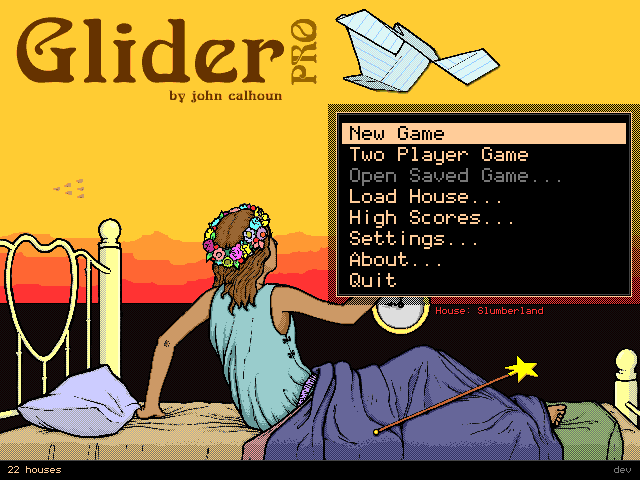
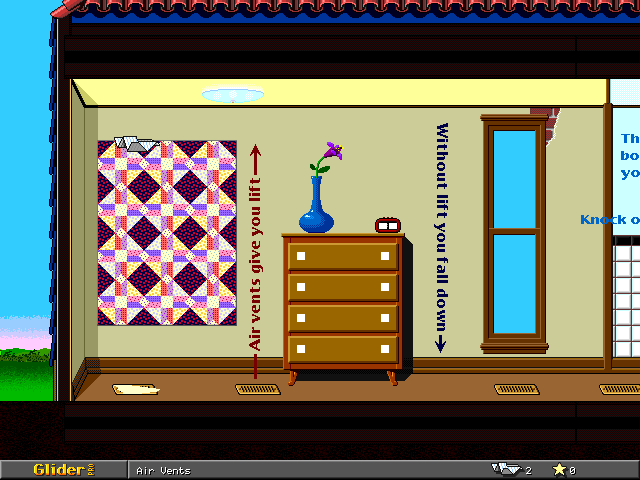
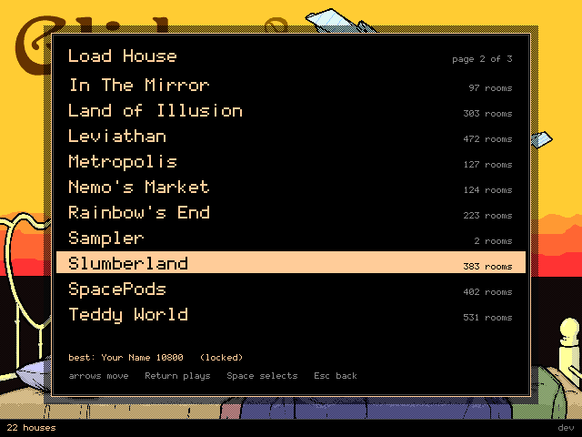

# gliderGo

A port of **Glider PRO** — John Calhoun's 1994 Macintosh game about flying a paper aeroplane
around somebody's house — to Go, for Linux. It ships with the original's art, sounds, music and
all 22 of its houses, so there is nothing to download and no copy of the old game to find. Clone
it and `make run`.



## The game

You are a paper glider. Furnace vents and air ducts push you up; the moment you leave one you
start sinking. That is the whole idea, and everything else in Glider PRO exists to make crossing
one more room harder than the last — fans, candles, toasters that fire toast at you, rubber
bands, cats, clocks, the lot.



There are 22 houses in the box and 4,070 rooms between them. The largest, Teddy World, is 531
rooms on its own. Calhoun wrote some of them; most are by Jonathan Chin, Ward Hartenstein, Steve
Sullivan, Shawn Brenneman and Kim Money, who were still building levels for this thing well after
it shipped.



Casady & Greene published it; Calhoun later released the source under the GPLv2, which is the
only reason this port can exist. Upstream is
[softdorothy/glider_pro](https://github.com/softdorothy/glider_pro), pinned at commit `94fed96`
— the reference every line of the port was written against. His C is not redistributed here;
what is vendored under `GliderPRO/` is the game data the extractors read.

## What this is

A transcription, not a remake. The physics are the original's integer arithmetic ported out of
`Player.c` a case at a time. Rooms compose in the original's draw order, including two of its
drawing bugs, kept on purpose. The random number generator is the Mac Toolbox's, reimplemented so
its draws come out in the same order. Where the port does behave differently, the reason is
written down in [docs/IMPROVEMENTS.md](docs/IMPROVEMENTS.md) rather than left for you to find.

It is standard-library Go with no third-party modules at all — no game engine, no SDL binding, no
audio library. There is no `go.sum` here because there is nothing to lock, and a test asserts it
stays that way.

Linux/X11 and Windows/GDI both draw. Neither backend needs a game library: X11 is a few hundred
lines of cgo against Xlib, and Windows is pure `syscall` — no cgo, no redistributable, nothing to
install. macOS and cross-compiled arm64 still run headless, which is most of the port but none of
the window.

The Windows half was written on an offline Linux machine that cannot run it, which is worth stating
plainly rather than in a footnote. It has since been run: 4,320 frames on a Windows Server 2025
desktop, and the pixels its window put on that screen match a Linux-rendered frame exactly, pixel
for pixel — [docs/windows-first-run.md](docs/windows-first-run.md) is the write-up, including the
three things it did not cover. Two of those are worth knowing before you file a bug: nobody has
played it with a keyboard yet, and `windows/arm64` has still never run at all.

## Where it is up to

**Stage 1 is done.** The game plays start to finish on all 22 houses, with sound, the title
screen and house picker, settings, high scores, saved games, both endings, and two-player on one
keyboard.

**Stage 4's Windows backend landed early**, out of plan order, because a release that shipped two
Windows archives which could not draw was the wrong thing to ship. It is pure `syscall` — GDI for
the pixels, `WM_KEYDOWN` for the glider, `WM_CHAR` for typing a high-score name on a keyboard
layout this port has never seen — and it needs no cgo, so it cross-compiles from Linux.

**Windows sound came with it**, for the same reason: a Windows archive that draws and cannot make a
noise is half a game. The port now carries a `waveOut` driver (pure `syscall` again, no cgo), so an
unzipped `.exe` plays without FFmpeg or anything else installed.

Next is Stage 2, new houses in the spirit of the originals and selectable alongside them, and
then Stage 3, a networked race: one machine hosts, another joins, furthest on one life wins.
Then the house editor the original had (Stage 5), and macOS and possibly mobile (Stage 6), which
needs a CoreAudio sink behind the same seam the Windows one arrived through.

- [docs/PLAN.md](docs/PLAN.md) — the staged plan and the decisions behind it
- [CHANGELOG.md](CHANGELOG.md) — what each stage actually landed
- [docs/IMPROVEMENTS.md](docs/IMPROVEMENTS.md) — the honest list of what is still wrong or missing

## Getting a build

Every `v*` tag packages six archives and attaches them to a GitHub Release with a `SHA256SUMS`
beside them. Unpack one and run it from anywhere: the 1994 art, the sounds and all 22 houses are
compiled into the binary, so there is no asset directory to keep beside it and nothing to install.
That is why it is 15 MB. `linux-amd64` and the two `windows` archives draw to a screen; the other
three are marked `headless` and explain themselves in the archive. Every archive carries a
`HOW-TO-RUN.txt`.

If the Releases page has nothing you want, building it is four seconds after the clone.

## Building

Go 1.23 or newer, and one system package:

```bash
sudo apt-get install -y build-essential pkg-config libx11-dev
git clone https://github.com/bwenstar/gliderGo && cd gliderGo
make run
```

The 1994 data is committed, decoded, under `assets/extracted/` — art, sounds, music and every
house. No extraction step, no asset download, no network, and you do not need python3 to play.
`assets/extracted.zip` is that tree packed for `go:embed`, which is how a built binary carries its
own assets and needs no files beside it; `make assets` re-derives both from `GliderPRO/` if you are
working on the extractors, `make assets-check` proves the tree is byte-for-byte what they produce,
and `go test ./assets` proves the archive still matches the tree.

`libx11-dev` is a hard requirement rather than a nicety: cgo compiles the X11 backend during
`vet` and `test`, so without its pkg-config file even `make check` fails. `make headless` is the
build that needs neither it nor a display.

On Windows there is no equivalent line, because there is nothing to install: `go build
./cmd/glidergo` with no cgo produces a `.exe` that draws. `make cross-windows` builds it from
Linux, and `make cross` builds every target a release ships.

```bash
make check      # fmt, vet, tests, build, headless, audio, pixel corpus, cross-compile
make doctor     # what your machine has and what it is missing
make help       # every target, one line each
```

Run those from the repository root, which is where the Makefile expects to be. The binary it
builds does not care: `bin/glidergo` carries its own assets and plays from any directory. If you
have no Go,
`./scripts/bootstrap-dev-env.sh` installs one into your home directory without root; see
[docs/DEV_ENVIRONMENT.md](docs/DEV_ENVIRONMENT.md) §1 for that and §2 for other distributions.

Sound takes the shortest road each platform offers, and `-audio list` prints what yours has, best
first. On Windows that is a `waveOut` driver built into the binary — no FFmpeg, no redistributable,
nothing to install. On Linux the mix is piped as raw PCM to whichever of `pw-play`, `paplay`,
`aplay`, `ffplay` or `play` you already have, which is deliberate rather than lazy: every desktop
ships at least one, they all read s16le mono on stdin, and a player that crashes takes nothing with
it, where an ALSA callback lives inside the game's address space. `-volume 0..7` is the original's
range, `-audio waveout` or `-audio aplay` insists on one output, and `-wav out.wav` writes the mix
to a file whether or not anything is playing it. With no output at all the game runs silently rather
than refusing to start.

The Windows sink has been run, on a Windows Server 2025 desktop: it found the machine's output
device, took every sound the game asked it to play and refused none
([docs/windows-first-run.md](docs/windows-first-run.md)). That was one machine with one sound card,
so if it misbehaves on yours, `-audio ffplay` takes the external-player road instead
([docs/IMPROVEMENTS.md](docs/IMPROVEMENTS.md) 2.48) and `-wav out.wav` writes the mix to a file so
you can hear what you should have heard.

## Controls

Keyboard only, because Glider PRO was: the only mouse in the original was in its level editor.

| Title screen | |
|---|---|
| `↑` `↓` `Return` | move the cursor, choose |
| `N` / `2` | one-player / two-player game |
| `L` | load a house — `←` `→` page, a letter jumps, `Return` plays |
| `O` | open the selected house's saved game |
| `H` / `S` / `A` | high scores / settings / about (`C` from there for the credits) |
| `Q` or `Esc` | quit |

| In a game | Player one | Player two |
|---|---|---|
| steer | `←` `→` | `A` `D` |
| throw a rubber band | `↑` | `W` |
| use the battery | `↓` | `S` |
| pause | `Tab` or `Esc` | |
| save, or give up, a paused game | `S`, `Q` | |
| give up a glider stuck in limbo | `Delete` | |

All eight movement keys are rebindable from the settings screen. Four of them had to change from
the 1994 defaults: player two was on Control, Command, Option and Shift, which a modern window
manager takes before the game ever sees them.

The last four rows are the port's own and are deliberately not bindable, because each stands in
for something a 1994 Macintosh had and this does not. `Tab` pauses, as the original did, and
`Esc` pauses as well so that the key a stranger reaches for costs them nothing. `Q` from the
pause gives up and asks first — Command-Q was a chord nobody hit by accident and a bare `Q` is
one letter from the controls. `S` from the pause saves, which is where the original's save lived.
`Delete` is the original's own key for abandoning a glider in limbo. Closing the window quits
from anywhere.

## Two players, one keyboard

Press `2`. Both gliders share the room and almost everything in it — one battery charge, one roll
of foil, one bundle of rubber bands, and four lives between them rather than two each. Whoever
leaves a room first picks the exit and the other has to follow. The original has three different
answers to what happens when it cannot:

- through a **wall, ceiling, floor or the stairs**, the follower is refused audibly and bounced
  back the way it came;
- through a **transporter, mailbox or duct**, it is refused in total silence, and only if it is
  standing in the very same one — so two gliders in two different transporters will wait for each
  other forever, and `Delete`, at the cost of a life, is the only way out;
- through the **manhole** there is no check at all. Both go.

That is transcribed rather than designed, and `internal/game/twoplayer_test.go` pins it. The one
consequence worth an escape hatch is the deadlock: `Delete` is player one's key, so player two
cannot break it. Setting `"player2_give_up": true` gives them the key as well.

## Settings, scores and saves

Settings are one JSON file in `~/.config/glidergo/prefs.json`, written when the settings screen
closes rather than at quit. A hand-edited or truncated one is repaired and complained about, not
refused.

There is a `fixes` block in that file which is deliberately not on any screen: four switches,
each correcting a genuine bug in the 1994 code — a mirror that blinks a candle flame out, a
mirror that draws the wrong player, a stray sparkle in the corner of a room, and
`player2_give_up`. All four default to off, because off is what the original did and what the
pixel corpus is recorded against.

High scores are per house, ten to a board, and **sorted on rooms visited before points** — worth
knowing before you optimise for the wrong number. Twenty of the 22 houses still carry their
authors' own playtesting from 1995: `Ozma` is top of thirteen boards, and the best run in the box
is 108 rooms and 47,000 points through ImagineHouse PRO II on 1995-07-03. New scores go beside
them in `~/.local/share/glidergo/scores/<house>.scores`; the house files themselves are never written
to, since rewriting 185 KB of 1994 binary to save 292 bytes is one power cut away from losing a
house.

Saved games work from the pause with `S`, and `O` or `-resume` picks one up: the room, the score,
the gliders left, what you were carrying, and every switch you had thrown anywhere in the house.

Two of the shipped houses have a game saved inside them from 1995 — Titanic at room 104 with
4,700 points, ImagineHouse PRO II at room 45 with 5,900 — and those load too, which took some
doing. Every saved-game path in the 1994 source is dead code: the writer's body is commented out,
the reader returns false on its first live statement, and the validation that survives compares
the wrong timestamp, so it would have rejected every file its own writer produced. The four
decisions the reconstruction needed are numbered in `internal/house/savedgame.go`.

Each of these can be pointed elsewhere or turned off — `-prefs`, `-scores`, `-saves`, each taking
a path or `none`. `-import-prefs` converts a 1994 226-byte `Glider Prefs` file.

## How faithful is it?

A test suite rather than a promise:

- `internal/fidelity` holds a hash of every frame's pixels for a set of scripted runs, plus
  reference PNGs. Move a pixel and the hashes move; regenerating them is deliberate and shows up
  in the diff.
- The 1994 attract-mode demo — 1,117 recorded keystrokes of somebody flying Demo House for about
  two minutes — replays through this port's own physics. It does not finish yet: the glider dies
  573 records in, and closing that gap is the sharpest target the project has.
- The twenty-row fidelity contract in [docs/ORIGINAL_GAME.md](docs/ORIGINAL_GAME.md) §19.1 is
  audited row by row, with a citation into the C for each and five written exceptions.

## glidertool

The workshop for the 1994 data. `make glidertool`, then:

```bash
bin/glidertool house info assets/extracted/houses/*.house    # 22 houses, 4,070 rooms
bin/glidertool house dump "assets/extracted/houses/Demo House.house" | less
bin/glidertool house build my-house.txt -o my-house.house    # and back again, byte for byte
bin/glidertool render -all -o /tmp/demo "assets/extracted/houses/Demo House.house"
bin/glidertool replay -house "CD Demo House" -frames 600 -wav /tmp/run.wav
bin/glidertool types                                         # the 117 object types
```

`house dump` and `house build` are how new houses will be authored and how a house shows up in a
diff. `render` composes a room the way the game does and writes a PNG, which is how the renderer
got checked by eye. `replay` runs a scripted session headlessly, which is what a useful bug report
carries.

## What is in here

| Path | What it is |
|---|---|
| `GliderPRO/` | The original's *data*, vendored read-only: `Glider PRO.r` — the whole resource fork — and all 22 houses. The 1994 C itself is not here; see below. |
| `assets/extracted/` | The same data decoded and committed, so a clone plays. Output, but output that ships. |
| `assets/extracted.zip` | That tree packed for `go:embed`. It is what every binary carries, which is why one runs with no files beside it. |
| `internal/game/` | The world: 117 object types, collision, room transitions, the animated locale. |
| `internal/house/` | The house model, the 1994 binary codec both ways, and a text format meant to be hand-written and diffed. |
| `internal/render/` | Room composition on an 8-bit indexed surface, because the original's shadows OR palette *indices* together. |
| `internal/platform/` | 640×480 software framebuffer; X11 (cgo), Windows (pure `syscall`) and headless (PNG/WAV) backends. |
| `internal/replay/`, `internal/fidelity/` | The determinism harness and the pixel corpus. |
| `cmd/glidergo`, `cmd/glidertool` | The game, and the tool above. |
| `tools/` | The asset extractors: BinHex, Rez, PICT → PNG, `'snd '` → PCM, QuickTime → index buffers. Standard-library python3. |
| `docs/ORIGINAL_GAME.md` | How the original behaves. Read this one first. |
| `docs/analysis/` | 29 byte-level specs reverse-documented from the C. The detailed authority. |

## Working on the original source

The 1994 C is not in this repository. `docs/` cites it about 9,500 times all the same, because
those citations are the receipts for the transcription — so they are pinned to a commit rather
than to a copy:

```bash
git clone https://github.com/softdorothy/glider_pro /tmp/glider_pro
git -C /tmp/glider_pro checkout 94fed96e0b4c810a6ac861e5d4b14d625a5a1c31
cp -r /tmp/glider_pro/Sources /tmp/glider_pro/Headers GliderPRO/
```

That puts them where the docs say they are, so every `GliderPRO/Sources/...:line` reference
resolves; both directories are gitignored, so your tree stays clean. `94fed96` is the commit
the port was written against, and the tree that was read was
byte-for-byte that commit's, verified by `diff -r` over all 137 files. Nothing in the build,
the tests or the game needs it — `make check` and `make assets-check` both pass without it.

One trap once you have it: `Sources/*.c` and `Headers/*.h` are classic Mac text with **CR-only
line endings**, so `wc -l` says `0` and most tools see one enormous line. Line numbers in the
docs are into the LF-normalised copy:

```bash
tr '\r' '\n' < "GliderPRO/Sources/Player.c" > /tmp/Player.c
```

`Glider PRO.r` is the exception and uses LF. It, the 22 houses, and upstream's own `README.md`
and licence *are* vendored here, unmodified — they are what `tools/` decodes into
`assets/extracted/`, and `make assets-check` proves the committed tree is exactly their output.

## Licence

**GPLv2** — see [LICENSE](LICENSE). The port is © 2026 the gliderGo authors; the original game is
© John Calhoun.

Upstream's grant is exact and has no "or any later version" clause, so this is GPLv2-**only**:
*"The source for Glider PRO is released under the GNU General Public License 2 as published by
the Free Software Foundation."* gliderGo is transcribed from that source function by function, is
unambiguously a derivative work, and carries the same licence.

One caveat, stated plainly because it is the last thing standing between this and a release
someone else can rely on: **the assets are not the source.** That grant is about code. The houses
are credited to five other authors, and two PICT resources derive from illustrations by John R.
Neill (*Ozma of Oz*) and Winsor McCay (*Little Nemo*). This repository redistributes all of it —
`GliderPRO/`'s resource fork and houses byte-for-byte as upstream ships them, `assets/extracted/`
decoded from those, and `assets/extracted.zip` packed from that and welded into every binary a
release attaches — on the reasoning that upstream publishes the same files in the same layout. That reading is defensible and it is not confirmed;
nobody has asked John Calhoun. [docs/IMPROVEMENTS.md](docs/IMPROVEMENTS.md) §1.2 lays out the
choice and says where it stands.

Original game by **John Calhoun**, published by Casady & Greene. Screenshots above are this
port's own output, from `make headless`.
