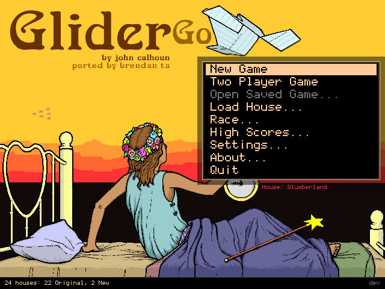
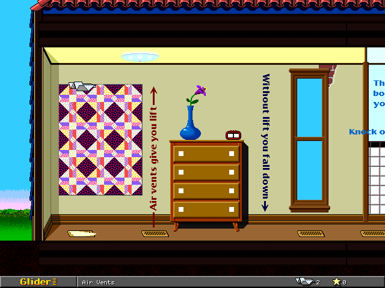
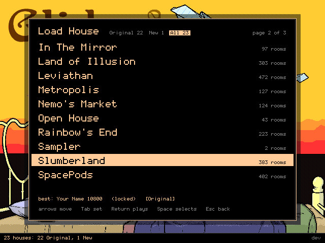

# gliderGo

A port of **Glider PRO** — John Calhoun's 1994 Macintosh game about flying a paper aeroplane
around somebody's house — to Go, for Linux and Windows. It ships with the original's art, sounds,
music and all 22 of its houses inside the binary, so there is no copy of the old game to find and
nothing to install beside it. Download it from the
[Releases page](https://github.com/bwenstar/gliderGo/releases), or clone it and `make run`.



## The game

You are a paper glider. Furnace vents and air ducts push you up; the moment you leave one you
start sinking. That is the whole idea, and everything else in Glider PRO exists to make crossing
one more room harder than the last — fans, candles, toasters that fire toast at you, rubber
bands, cats, clocks, the lot.



There are 22 houses in the box and 4,070 rooms between them. The largest, Teddy World, is 531
rooms on its own. Calhoun wrote some of them; most are by Jonathan Chin, Ward Hartenstein, Steve
Sullivan, Shawn Brenneman and Kim Money, who were still building levels for this thing well after
it shipped.



Two rows in that list are this port's own — "Open House" and "Boarding House" — and the strip along
the top is there so that nothing of ours can be mistaken for theirs: **Original 22, New 2**, Tab to
show one set at a time. The list is sorted by name and ours sit in among them, which is exactly why
the strip and the count are drawn rather than left to the reader. A house's set is the root it was
found in and never a guess from its name.

Casady & Greene published it; Calhoun later released the source under the GPLv2, which is the
only reason this port can exist. Upstream is
[softdorothy/glider_pro](https://github.com/softdorothy/glider_pro), pinned at commit `94fed96`
— the reference every line of the port was written against. His C is not redistributed here;
what is vendored under `GliderPRO/` is the game data the extractors read.

## What this is

A transcription, not a remake. The physics are the original's integer arithmetic ported out of
`Player.c` a case at a time. Rooms compose in the original's draw order, including two of its
drawing bugs, kept on purpose. The random number generator is the Mac Toolbox's, reimplemented so
its draws come out in the same order. Where the port does behave differently, the reason is
written down in [docs/IMPROVEMENTS.md](docs/IMPROVEMENTS.md) rather than left for you to find.

It is standard-library Go with no third-party modules at all — no game engine, no SDL binding, no
audio library. There is no `go.sum` here because there is nothing to lock, and a test asserts it
stays that way.

Linux/X11 and Windows/GDI both draw. Neither backend needs a game library: X11 is a few hundred
lines of cgo against Xlib, and Windows is pure `syscall` — no cgo, no redistributable, nothing to
install. macOS and linux/arm64 still run headless, which is most of the port but none of the
window.

The Windows half was written on an offline Linux machine that cannot run it, which is worth stating
plainly rather than in a footnote. It has since been run: 4,320 frames on a Windows Server 2025
desktop, and the pixels its window put on that screen match a Linux-rendered frame exactly, pixel
for pixel — [docs/windows-first-run.md](docs/windows-first-run.md) is the write-up, including the
four things it did not cover. Two of those are worth knowing before you file a bug: nobody has
played it with a keyboard yet, and `windows/arm64` has still never run at all. Some Windows code
written since that run has not run on Windows yet either: the first window sized from the
monitor, where that window is placed, a present that sends only what changed, and a console that
waits after an error.

## Where it is up to

**Stage 1 is done.** The game plays start to finish on all 22 houses, with sound, the title
screen and house picker, settings, high scores, saved games, both endings, and two-player on one
keyboard.

**Stage 4's Windows backend landed early**, out of plan order, because a release that shipped two
Windows archives which could not draw was the wrong thing to ship. It is pure `syscall` — GDI for
the pixels, `WM_KEYDOWN` for the glider, `WM_CHAR` for typing a high-score name on a keyboard
layout this port has never seen — and it needs no cgo, so it cross-compiles from Linux.

**Windows sound came with it**, for the same reason: a Windows archive that draws and cannot make a
noise is half a game. The port now carries a `waveOut` driver (pure `syscall` again, no cgo), so an
unzipped `.exe` plays without FFmpeg or anything else installed.

**Stage 2 is underway.** `glidertool house lint` is the validator new houses have to pass, and the
picker now keeps **Original** and **New** apart — a house's set is the root it was found in, never a
guess from its name, so nothing of ours can pass itself off as 1994's. `-levels DIR` puts a directory
of your own houses in the New set instead of the ones built in; Tab cycles the sets, and with only
one set on the shelf the picker draws exactly the screen it always did.

**And two houses of our own are on the shelf.** Both are written against the measured profile of the
originals in [docs/analysis/original-houses.md](docs/analysis/original-houses.md) rather than just
"some rooms", and every numeric target in each one's header is asserted by a Go test, so those tables
cannot quietly stop being true.

`levels/Open House.house.txt` is 43 rooms at that document's tutorial tier, and it teaches the thing
the original never explains: a glider crossing a floor vent at cruising speed only gains about sixty
pixels of height, and spends more than half of that again on every screen it crosses, so **no house in
this game is crossable with the arrow held down.** You stop in each updraft, ride it to the ceiling,
and go.

`levels/Boarding House.house.txt` is 51 rooms at the tier above, and it exists to check that the
profile is a method and not a coincidence — one house fitted to one column of a table proves nothing
about the table. It is also the first house anyone has written for this game, ours or 1994's, that
uses **all eighteen** built-in backgrounds, which is how `kRoof` was found to be the one background
where a tile is physics rather than decoration: four of its eight have no surface to land on at all,
and the glider that flies over them dies.

**Both are inside the binary**, like the twenty-two: a downloaded executable lists 24 houses and needs
no files beside it. `make levels` builds them out of the text for inspection and `-levels DIR` plays a
directory you are still editing; the text is meant to be read and taken apart.

**Stage 3 is done: a networked race.** Two machines race the same house from the same seed —
separate rooms, separate gliders, one answer about who won. It is the thing the original never had,
and it is not the original's two-player mode; see
[Two players, two machines](#two-players-two-machines) below for both halves of that sentence.
`Race...` on the title screen arranges one, and `-host` / `-join <address>` are the same arrangement
from a shell. What is still missing is smaller than it was: the guest has to name the house rather
than being told which one the host opened, and nothing finds the hosts on your network for you
([docs/IMPROVEMENTS.md](docs/IMPROVEMENTS.md) 4.28).

Then the house editor the original had (Stage 5), and macOS and possibly mobile (Stage 6), which
needs a CoreAudio sink behind the same seam the Windows one arrived through.

- [docs/PLAN.md](docs/PLAN.md) — the staged plan and the decisions behind it
- [CHANGELOG.md](CHANGELOG.md) — what each stage actually landed
- [docs/IMPROVEMENTS.md](docs/IMPROVEMENTS.md) — the honest list of what is still wrong or missing

## Getting a build

Every `v*` tag packages six archives and attaches them to a
[GitHub Release](https://github.com/bwenstar/gliderGo/releases) with a `SHA256SUMS` beside them.
Unpack one and run it from anywhere: the 1994 art, the sounds, all 22 of the original houses and the
ones this port has written since are compiled into the binary, so there is no asset directory to
keep beside it and nothing to install. That is why it is 15 MB. `linux-amd64` and the two `windows`
archives draw to a screen; the other three are marked `headless` and explain themselves in the
archive. Every archive carries a `HOW-TO-RUN.txt`.

Nothing is signed, so Windows and macOS warn the first time you open it, in words that read like a
broken download. The release notes and `HOW-TO-RUN.txt` say what each warning is and the way past
it. They also say what to do if Windows' antivirus removes `glidergo.exe`: check the zip
against `SHA256SUMS` before restoring it.

The oldest systems a release runs on:

| Archive | Needs |
|---|---|
| `linux-amd64` | glibc 2.34 or newer (Ubuntu 22.04, Debian 12, Fedora 35, RHEL 9 or later), and libX11 |
| `windows-amd64`, `windows-arm64` | Windows 10 or 11, or Windows Server 2016 or newer |
| `darwin-*-headless` | macOS 13 or newer |
| `linux-arm64-headless` | no libraries at all; it is statically linked |

The Windows and macOS rows are the Go toolchain's, not the game's. Releases are built with Go 1.27,
a version Go still sends security fixes for, rather than the 1.23 that building from source needs
(below), and each Go release sets its own floor. When releases move to a newer Go, this table is
checked again.

If the Releases page has nothing you want, building it is four seconds after the clone.

## Building

Go 1.23 or newer, and one system package:

```bash
sudo apt-get install -y build-essential pkg-config libx11-dev
git clone https://github.com/bwenstar/gliderGo && cd gliderGo
make run
```

The 1994 data is committed, decoded, under `assets/extracted/` — art, sounds, music and every
house. No extraction step, no asset download, no network, and you do not need python3 to play.
`assets/extracted.zip` is that tree packed for `go:embed`, which is how a built binary carries its
own assets and needs no files beside it; `make assets` re-derives both from `GliderPRO/` if you are
working on the extractors, `make assets-check` proves the tree is byte-for-byte what they produce,
and `go test ./assets` proves the archive still matches the tree.

`libx11-dev` is a hard requirement rather than a nicety: cgo compiles the X11 backend during
`vet` and `test`, so without its pkg-config file even `make check` fails. `make headless` is the
build that needs neither it nor a display.

On Windows there is no equivalent line, because there is nothing to install: `go build
./cmd/glidergo` with no cgo produces a `.exe` that draws. `make cross-windows` builds it from
Linux, and `make cross` builds every target a release ships.

```bash
make check      # fmt, vet, tests, build, headless, audio, pixel corpus, cross-compile, these docs
make doctor     # what your machine has and what it is missing
make help       # every target, one line each
```

Run those from the repository root, which is where the Makefile expects to be. The binary it
builds does not care: `bin/glidergo` carries its own assets and plays from any directory. If you
have no Go,
`./scripts/bootstrap-dev-env.sh` installs one into your home directory without root; see
[docs/DEV_ENVIRONMENT.md](docs/DEV_ENVIRONMENT.md) §1 for that and §2 for other distributions.

Sound takes the shortest road each platform offers, and `-audio list` prints what yours has, best
first. On Windows that is a `waveOut` driver built into the binary — no FFmpeg, no redistributable,
nothing to install. On Linux the mix is piped as raw PCM to whichever of `pw-play`, `paplay`,
`aplay`, `ffplay` or `play` you already have, which is deliberate rather than lazy: every desktop
ships at least one, they all read s16le mono on stdin, and a player that crashes takes nothing with
it, where an ALSA callback lives inside the game's address space. `-volume 0..7` is the original's
range, `-audio waveout` or `-audio aplay` insists on one output, and `-wav out.wav` writes the mix
to a file whether or not anything is playing it. With no output at all the game runs silently rather
than refusing to start.

The Windows sink has been run, on a Windows Server 2025 desktop: it found the machine's output
device, took every sound the game asked it to play and refused none
([docs/windows-first-run.md](docs/windows-first-run.md)). That was one machine with one sound card,
so if it misbehaves on yours, `-audio ffplay` takes the external-player road instead
([docs/IMPROVEMENTS.md](docs/IMPROVEMENTS.md) 2.48) and `-wav out.wav` writes the mix to a file so
you can hear what you should have heard.

## Controls

Keyboard only, because Glider PRO was: the only mouse in the original was in its level editor.

| Title screen | |
|---|---|
| `↑` `↓` `Return` | move the cursor, choose |
| `N` / `2` | one-player / two-player game |
| `L` | load a house — `←` `→` page, a letter jumps, `Return` plays |
| `O` | open the selected house's saved game |
| `H` / `S` / `A` | high scores / settings / about (`C` from there for the credits) |
| `Q` or `Esc` | quit |

| In a game | Player one | Player two |
|---|---|---|
| steer | `←` `→` | `A` `D` |
| throw a rubber band | `↑` | `W` |
| use the battery | `↓` | `S` |
| pause | `Tab` or `Esc` | |
| save, or give up, a paused game | `S`, `Q` | |
| give up a glider stuck in limbo | `Delete` | |

All eight movement keys are rebindable from the settings screen. Four of them had to change from
the 1994 defaults: player two was on Control, Command, Option and Shift, which a modern window
manager takes before the game ever sees them.

The last four rows are the port's own and are deliberately not bindable, because each stands in
for something a 1994 Macintosh had and this does not. `Tab` pauses, as the original did, and
`Esc` pauses as well so that the key a stranger reaches for costs them nothing. `Q` from the
pause gives up and asks first — Command-Q was a chord nobody hit by accident and a bare `Q` is
one letter from the controls. `S` from the pause saves, which is where the original's save lived.
`Delete` is the original's own key for abandoning a glider in limbo. Closing the window quits
from anywhere.

## Two players, one keyboard

Press `2`. Both gliders share the room and almost everything in it — one battery charge, one roll
of foil, one bundle of rubber bands, and four lives between them rather than two each. Whoever
leaves a room first picks the exit and the other has to follow. The original has three different
answers to what happens when it cannot:

- through a **wall, ceiling, floor or the stairs**, the follower is refused audibly and bounced
  back the way it came;
- through a **transporter, mailbox or duct**, it is refused in total silence, and only if it is
  standing in the very same one — so two gliders in two different transporters will wait for each
  other forever, and `Delete`, at the cost of a life, is the only way out;
- through the **manhole** there is no check at all. Both go.

That is transcribed rather than designed, and `internal/game/twoplayer_test.go` pins it. The one
consequence worth an escape hatch is the deadlock: `Delete` is player one's key, so player two
cannot break it. Setting `"player2_give_up": true` gives them the key as well.

## Two players, two machines

A different game from the one above, and the original never had it. There, two gliders share one
room and one roll of foil. Here each machine runs its own copy of the house and its own glider, and
the network carries how far each of you has got.

**From the title screen: `Race...`.** One player chooses Host and reads the address off the screen
that comes up; the other types it into Join and presses Return. Both have to have the same house
open first, and the screen names the one it is about to race in.

From a shell, which skips the title screen and is what a script or a second window wants:

```bash
bin/glidergo -host Slumberland                        # on one machine
bin/glidergo -join 192.168.1.20 Slumberland           # on the other, once the first is waiting
```

The waiting screen reads out this machine's addresses and the port it actually got, the address its
own traffic leaves from first — that top line is exactly what the other player types into Join —
with a ready-made `-join` command underneath for a partner who is also at a shell. `-port` moves both off 1994 (`-join 192.168.1.20:2000` says the
same thing), the house may be a name or a path, and `-host` on its own opens Slumberland. Escape
gives up while you are waiting. A host goes on waiting past anything that connects and is not the
race it is hosting — a guest with another house or release, a browser, some other program — and
says underneath whom it turned away and why.

**Furthest wins, and "furthest" means rooms visited** — the same number the 1994 high-score table
records, because a house is a graph and "how far" has no geometric answer. Finishing the house beats
any number of rooms, and ties break on score and then on frames simulated. Somebody who quits,
closes the window or has the game killed has forfeited, and the other one wins on the spot. A
machine that loses power, goes to sleep or drops off the network sends nothing to say so. The panel
goes on showing where it last was, and nothing is decided until the operating system gives up on
the connection, which can take many minutes. Escape on the screen that waits for the other run
leaves at once, and unless one of you had quit, there is then no result. There is no countdown and
nothing that depends on the two clocks agreeing, which is why a peer that started late is simply a
peer that has simulated fewer frames.

Both houses must hash identically or the match is refused. The screen tells a guest which house
the host is racing, or that theirs is a different copy of it, and the terminal has both names and
both hashes. Both machines must also run releases that fly the same: a release whose physics
changed is refused, naming both releases, and any two releases with the same physics race each
other. A release changes the physics only with a new middle number, so every 0.2.x races every
other 0.2.x, and the CHANGELOG says so when a release no longer races the ones before it. The
`fixes` block below is told to the other side and does not refuse a race, because none of its
switches changes how a glider flies. The race's screens say in small print which of them the other
side has on. Both machines agree a random seed between themselves, so `-seed` is refused, as are
`-two` and `-resume`, each with a sentence saying why. A small panel in the top-left corner shows
where the other player is while you fly, and it goes away when your run ends so that the game-over
and high-score screens are the original's. The race itself is not over until both runs are, however
far ahead you finish. Then both machines show the same result, as long as the connection held. A
network that fails between two machines that are both still running can leave each one scoring the
other as gone. A race started from `Race...` leaves its result on the title screen's status line,
where a game leaves its score.

**When the other machine cannot be reached**, the joining screen says what to check: the spelling,
the address, or that the machine answered and nothing is hosting yet. No answer at all is either a
host that has not started or a firewall dropping the port. After a few tries in a row the screen
says so. The host is the one that has to let the other in:

- **Windows** asks the first time you host. Tick the network you are on and click Allow access.
  Cancel is remembered as a no. Undo it in Windows Security, *Firewall & network protection*,
  *Allow an app through firewall*.
- **Linux** with a firewall on, usually ufw or firewalld, needs the port opened by hand:
  `sudo ufw allow 1994/tcp`, or `sudo firewall-cmd --add-port=1994/tcp`, which lasts until the next
  reboot.

**Racing beyond your network.** An address the waiting screen marks *(this network only)* is in a
private range. Another machine on the same Wi-Fi can reach it, and nothing beyond your router can.
The mark is read off the address, so a VPN that hands out a private address gets it too. Across the
internet, there are three ways:

- **A port forward.** On the host's router, forward TCP port 1994 to the address the waiting screen
  lists first. Then tell the other player your public address, which the router's own status page
  shows. Either machine can host, so the player whose router is easier to set up should. **Remove
  the forward when you are done.** While it is open, anyone who finds the port can reach the
  handshake. [SECURITY.md](SECURITY.md) says what that exposes.
- **A VPN between the two machines**, such as Tailscale. Each machine gets an address the other
  can reach, the router is left alone, and nothing is open to anyone else. A Tailscale address
  (100.x.y.z) is listed unmarked.
- **IPv6**, when both ends have it. There is no address translation, so there is nothing to
  forward. Home routers usually block incoming IPv6 connections, though, and so does the host's
  own firewall, so expect to open the port in both.

## Settings, scores and saves

The game keeps four things, and `glidergo -version` prints where each one is on your machine:

| | Linux | Windows | macOS |
|---|---|---|---|
| settings | `~/.config/glidergo/prefs.json` | `%AppData%\glidergo\prefs.json` | `~/Library/Application Support/glidergo/prefs.json` |
| high scores | `~/.local/share/glidergo/scores/` | `%AppData%\glidergo\scores\` | `~/Library/Application Support/glidergo/scores/` |
| saved games | `~/.local/share/glidergo/saves/` | `%AppData%\glidergo\saves\` | `~/Library/Application Support/glidergo/saves/` |
| crash report | `~/.local/share/glidergo/crash.log` | `%AppData%\glidergo\crash.log` | `~/Library/Application Support/glidergo/crash.log` |

On Linux, `$XDG_CONFIG_HOME` and `$XDG_DATA_HOME` move the first column's two roots, as the XDG
spec says. `GLIDERGO_CONFIG=DIR` puts all four under one directory. `GLIDERGO_DATA=DIR` puts the
scores, the saves and the crash report in `DIR` itself, with no subdirectories.

Settings are one JSON file, written when the settings screen closes rather than at quit. A hand-edited or truncated one is repaired and complained about, not
refused.

The window opens at the largest whole magnification that fits the monitor, title bar and all:
2× on 1080p, and at most 3× for now, until 4× has been measured on Windows. The settings screen's
magnification row changes that for the next launch, and `-scale N` for one run. A settings file
from 0.1.x keeps the 1× it was written with; step the row below 1×, or press R there, for auto.

There is a `fixes` block in that file which is deliberately not on any screen: four switches,
each correcting a genuine bug in the 1994 code — a mirror that blinks a candle flame out, a
mirror that draws the wrong player, a stray sparkle in the corner of a room, and
`player2_give_up`. All four default to off, because off is what the original did and what the
pixel corpus is recorded against.

High scores are per house, ten to a board, and **sorted on points alone**. The rooms visited are
stored beside each score but do not move it: on Davis Station, Kimmer's 40 rooms sit below Johnner's
38, on 17,500 points to 17,800. A race ranks the other way round, rooms before points (above).
Twenty of the 22 houses still carry their authors' own playtesting from 1995–2000: `Ozma` is top of
thirteen boards, and the best run in the box is 108 rooms and 47,000 points through ImagineHouse PRO
II on 1995-07-03. New scores go beside them in `scores/<house>.scores`; the house files themselves
are never written to, since rewriting 185 KB of 1994 binary to save 292 bytes is one power cut away
from losing a house.

Saved games work from the pause with `S`, and `O` or `-resume` picks one up: the room, the score,
the gliders left, what you were carrying, and every switch you had thrown anywhere in the house.

Two of the shipped houses have a game saved inside them from 1995 — Titanic at room 104 with
4,700 points, ImagineHouse PRO II at room 45 with 5,900 — and those load too, which took some
doing. Every saved-game path in the 1994 source is dead code: the writer's body is commented out,
the reader returns false on its first live statement, and the validation that survives compares
the wrong timestamp, so it would have rejected every file its own writer produced. The four
decisions the reconstruction needed are numbered in `internal/house/savedgame.go`.

If the game crashes, it leaves a report. Each start rewrites `crash.log`, beside `scores/` and
`saves/`, with what `glidergo -version` prints and then whatever stopped the run. The start after
a crash keeps that report as `crash-last.log`, and says so on the title screen. That file is the
one to attach to a bug report. Its `-version` block includes paths under your home directory, so
read it before you send it.

Settings, scores and saves can each be pointed elsewhere or turned off for one run — `-prefs`,
`-scores`, `-saves`, each taking a path or `none`. `-import-prefs` converts a 1994 226-byte `Glider Prefs` file.

## How faithful is it?

A test suite rather than a promise:

- `internal/fidelity` holds a hash of every frame's pixels for a set of scripted runs. The
  references are text, not images — `testdata/screens.hashes` and `testdata/duct.frames`, one line
  per frame — so moving a pixel moves a line, and re-recording is `-update` and shows up in the
  diff as the lines that changed. A failure writes the offending frame out as PNGs for you to look
  at; none are committed, because a committed PNG is a diff nobody can read.
- The 1994 attract-mode demo — 1,117 recorded keystrokes of somebody flying Demo House for about
  two minutes — replays through this port's own physics. It plays to the end: all 1,117 records
  are consumed, and the game is over three frames after the last one. A test fails if a change
  stops it short. Nothing in the recording says the flight is wrong, and the next check needs a
  trace from a real Mac.
- The twenty-row fidelity contract in [docs/ORIGINAL_GAME.md](docs/ORIGINAL_GAME.md) §19.1 is
  audited row by row, with a citation into the C for each and five written exceptions.
- Those citations are themselves checked. `go test ./internal/citations/` opens the pinned 1994 C
  and resolves all ~17,800 of them — every file name, every line number, every range — so a claim
  about the original that points at a line the original does not have fails the build. It found
  twenty-two broken ones the first time it ran, all now fixed by reading the C.
  [docs/CITATIONS.md](docs/CITATIONS.md) is the whole story, including what it deliberately does
  not promise.

## glidertool

The workshop for the 1994 data. `make glidertool`, then:

```bash
bin/glidertool house info assets/extracted/houses/*.house    # 22 houses, 4,070 rooms
bin/glidertool house dump "assets/extracted/houses/Demo House.house" | less
bin/glidertool house build -o my-house.house my-house.txt    # and back again, byte for byte
bin/glidertool house lint my-house.house                     # will it play as authored?
bin/glidertool house checks                                  # what each lint check means
bin/glidertool house stats -tier small my-house.house        # is it the shape of a 1994 house?
bin/glidertool render -all -o /tmp/demo "assets/extracted/houses/Demo House.house"
bin/glidertool replay -house "CD Demo House" -frames 600 -wav /tmp/run.wav
bin/glidertool types                                         # the 117 object types
```

Every line above puts its flags before the file, which is a house style and not a requirement:
`house stats my-house.house -tier small` means the same thing, and so does `glidergo Slumberland
-scale 2`. Go's `flag` package stops at the first non-flag argument, which made the second ordering
fail in three different misleading ways, so both binaries reorder their arguments before parsing them
(`internal/cliargs`, [`docs/IMPROVEMENTS.md`](docs/IMPROVEMENTS.md) 4.13).

`house dump` and `house build` are how new houses are authored and how a house shows up in a
diff — `make levels` is those two plus `house lint` over everything in `levels/`. `render` composes a
room the way the game does and writes a PNG, which is how the renderer got checked by eye, and
`render -all` over a house of your own is the fastest way to find a lamp you forgot. `replay` runs a scripted session headlessly, which is what a useful bug report
carries.

`house lint` is the other half of authoring. `house check` asks whether the file survived both
codecs; `house lint` asks whether the house will *play* — a transporter whose link points at a room
that does not exist, a staircase with nothing to arrive on, a sound trigger naming a `snd ` the
house does not carry. None of those is a crash in the original: the player simply cannot get out of
the room, which is exactly why it is worth catching before anybody plays it. Thirty-two checks at
three severities, `-fail warn` for a CI step, and `house checks` prints the table so a finding can
be looked up. Run over the 22 shipped houses it reports 637 notes, 48 warnings and one error, and
that is the calibration: the originals have to lint clean enough for the exit code to mean
something.

`house stats` asks the third question, and it is not a question about correctness at all: not
whether the file survived a round trip or whether the house can be finished, but whether it is the
size and shape of the houses it will be played next to. Eighteen numbers — rooms, objects and
prizes per room, how much of the house is dark, how deep the room graph goes — measured the way
§10.2 of [`docs/analysis/original-houses.md`](docs/analysis/original-houses.md) measured the 22
originals, and `-tier` compares them against one of that table's five columns, from `tutorial` to
`epic`. `-rooms` names the rooms behind the counts, `-summary` prints one line per house so a glob
over the shipped tree is a readable table, and `-fail` turns the comparison into an exit status.
That last flag deserves its warning, which the output repeats: the bands are what the 1994 houses
*did*, not rules anybody wrote down, and some of them are two houses wide. The port's own Open House
sits outside one of them on purpose — its room graph is ten hops deep where the two tutorial-sized
originals are eleven and fifteen — because it is better connected than they are, and chasing the
number would mean making a hand-flown house worse. So the tool is for noticing, and the noticing is
worth having: measuring Open House is how that miss was found in the first place.

## What is in here

| Path | What it is |
|---|---|
| `GliderPRO/` | The original's *data*, vendored read-only: `Glider PRO.r` — the whole resource fork — and all 22 houses. The 1994 C itself is not here; see below. |
| `assets/extracted/` | The same data decoded and committed, so a clone plays. Output, but output that ships. |
| `assets/extracted.zip` | That tree packed for `go:embed`. It is what every binary carries, which is why one runs with no files beside it. |
| `assets/levels.zip` | The port's own houses, packed the same way. Committed rather than generated, because the tool that packs it is built from a package that embeds it: a clone without this file cannot build the tool that would rebuild it. |
| `internal/game/` | The world: 117 object types, collision, room transitions, the animated locale. |
| `internal/house/` | The house model, the 1994 binary codec both ways, and a text format meant to be hand-written and diffed. |
| `levels/` | Houses this port wrote, in that text format — the source, and the only copy a human edits. `make levels` compiles and lints them; `make levels-zip` packs them into the binary. |
| `internal/profile/` | A house measured against the 1994 ones: the eighteen rows of `docs/analysis/original-houses.md` §10.2, and the static room graph behind the reachable count and the longest shortest path. `glidertool house stats` prints it. |
| `internal/render/` | Room composition on an 8-bit indexed surface, because the original's shadows OR palette *indices* together. |
| `internal/shell/` | Everything before and around the game: title screen, house picker, settings, about, credits, the score board. |
| `internal/audio/` | The 22 kHz mixer, the `'snd '` bank and the score, plus the platform sinks. |
| `internal/platform/` | 640×480 software framebuffer; X11 (cgo), Windows (pure `syscall`) and headless (PNG/WAV) backends. |
| `internal/netplay/` | The two-player race over a network: the handshake, the wire format from `docs/analysis/determinism-networking.md` §10.4, and the arithmetic that decides a winner. Two separate worlds, one result both sides compute for themselves. |
| `internal/replay/`, `internal/fidelity/` | The determinism harness and the pixel corpus. |
| `internal/citations/` | The check that every pointer into the 1994 C resolves. See `docs/CITATIONS.md`. |
| the other eleven | `internal/prefs/`, `internal/scores/`, `internal/saved/`, `internal/demo/`, `internal/credits/`, `internal/project/`, `internal/datadir/`, `internal/assetfs/`, `internal/assetpack/`, `internal/cliargs/`, `internal/module/` — one job each, and each opens with a package comment saying which. |
| `cmd/glidergo`, `cmd/glidertool` | The game, and the tool above. |
| `tools/` | The asset extractors — BinHex, Rez, PICT → PNG, `'snd '` → PCM, QuickTime → index buffers — in standard-library python3; and two Go commands `make` runs, `packassets` for the archives the binaries embed and `docscheck` for the command lines this document and `CONTRIBUTING.md` tell you to run. `make tools` lists them all. |
| `docs/ORIGINAL_GAME.md` | How the original behaves. Read this one first. |
| `docs/analysis/` | 29 byte-level specs reverse-documented from the C. The detailed authority. |
| `docs/CITATIONS.md` | What a citation into the 1994 C means here, how to make one resolve, and what the checker does and does not promise. |

## Working on the original source

The 1994 C is not in this repository. This one cites it about 17,800 times all the same, because
those citations are the receipts for the transcription — so they are pinned to a commit rather
than to a copy:

```bash
git clone https://github.com/softdorothy/glider_pro /tmp/glider_pro
git -C /tmp/glider_pro checkout 94fed96e0b4c810a6ac861e5d4b14d625a5a1c31
cp -r /tmp/glider_pro/Sources /tmp/glider_pro/Headers /tmp/glider_pro/Prefix.h GliderPRO/
```

That puts them where the docs say they are, so every `GliderPRO/Sources/...:line` reference
resolves; all three are gitignored, so your tree stays clean. `Prefix.h` is one file at the top
of upstream's tree rather than inside `Headers/`, and it is copied because four citations point at
it: it is the seven `#define`s that select the Carbon target, which is why the port transcribes
the Carbon arm of every `#if TARGET_CARBON`. `94fed96` is the commit
the port was written against, and the tree that was read was
byte-for-byte that commit's, verified by `diff -r` over all 137 files. Nothing in the build,
the tests or the game needs it — `make check` and `make assets-check` both pass without it.

One trap once you have it: `Sources/*.c` and `Headers/*.h` are classic Mac text with **CR-only
line endings**, so `wc -l` says `0` and most tools see one enormous line. Line numbers in the
docs are into the LF-normalised copy:

```bash
tr '\r' '\n' < "GliderPRO/Sources/Player.c" > /tmp/Player.c
```

`Glider PRO.r` is the exception and uses LF. It, the 22 houses, and upstream's own `README.md`
and licence *are* vendored here, unmodified — they are what `tools/` decodes into
`assets/extracted/`, and `make assets-check` proves the committed tree is exactly their output.

## Licence

**GPLv2** — see [LICENSE](LICENSE). The port is © 2026 the gliderGo authors; the original game is
© John Calhoun.

Upstream's grant is exact and has no "or any later version" clause, so this is GPLv2-**only**:
*"The source for Glider PRO is released under the GNU General Public License 2 as published by
the Free Software Foundation."* gliderGo is transcribed from that source function by function, is
unambiguously a derivative work, and carries the same licence.

The Go runtime and standard library compiled into `glidergo` and `glidertool` are
BSD-3-Clause, © The Go Authors; every release archive carries their licence as
`THIRD-PARTY-NOTICES.txt`, and `-version` prints the line.

One caveat, stated plainly because it is the last thing standing between this and a release
someone else can rely on: **the assets are not the source.** That grant is about code. The houses
are credited to five other authors, two PICT resources derive from illustrations by John R.
Neill (*Ozma of Oz*) and Winsor McCay (*Little Nemo*), and the About plate sets a line of T. S.
Eliot's *Prufrock* (1915) across the bottom of the second of those. This repository redistributes all of it —
`GliderPRO/`'s resource fork and houses byte-for-byte as upstream ships them, `assets/extracted/`
decoded from those, and `assets/extracted.zip` packed from that and welded into every binary a
release attaches — on the reasoning that upstream publishes the same files in the same layout. That reading is defensible and it is not confirmed;
nobody has asked John Calhoun. [docs/IMPROVEMENTS.md](docs/IMPROVEMENTS.md) §1.2 lays out the
choice and says where it stands.

Original game by **John Calhoun**, published by Casady & Greene. Screenshots above are this
port's own output, from `make headless`.
